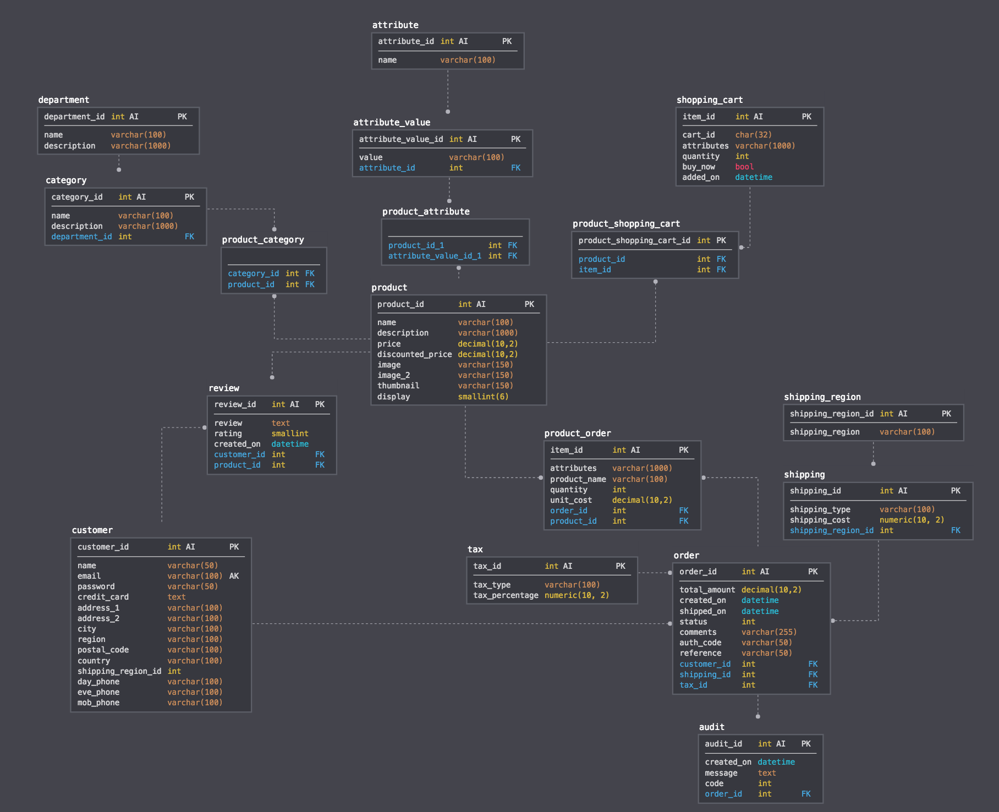
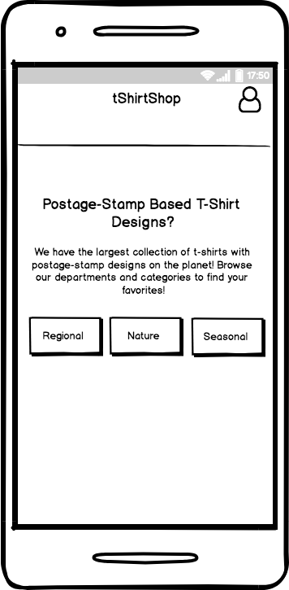

# t-shirt-store
Developer Set-Up Steps:
1. npm client-install
2. npm client-build
3. npm install
4 npm run test
5 npm start

##Schema

##Mobile Landing Page

##About Aplication:
* Uses MERN stack except mySQL instead of MongoDB.
* Pictures are hosted on cloudinary
* MySQL DB is hosted on ScaleGrid
* Front-end uses React with Redux
* Cart information is stored on users localstorage using their ipAdress + 'tShirtStore' as the key
* Once a user logs in a jwtToken is saved on their localStorage and is good for 1 hour
